# LeNet-5 Hardware Accelerator on FPGA
### INT8-Quantized CNN Inference Engine for MNIST Handwritten Digit Recognition

<div align="center">


</div>

---

## 📌 Overview

This project presents a **fully custom RTL hardware accelerator** for LeNet-5 CNN inference, designed in Verilog/SystemVerilog and deployed on a **Zynq UltraScale+ SoC (Kria KV260)**. The accelerator performs **INT8 quantized inference** on 28×28 MNIST grayscale images, classifying handwritten digits (0–9) with **98.46% accuracy** at an average latency of **62.42 µs/image**.

The design is integrated as an **AXI4-Lite IP core** and communicates with the ARM Cortex-A53 processor via memory-mapped registers.

> **Authors:** Đỗ Quốc Khánh (23520715)  
> **Supervisor:** TS. Trần Thị Điểm  
> **Institution:** University of Information Technology (UIT) — Faculty of Computer Engineering

---

## 🖥️ Equipment Setup for Kria KV260 Development

### A. Hardware Overview

In this project, I set up a development environment to work with the Kria KV260 FPGA platform for building and running an embedded SoC system.


The main hardware components include:

- **Kria KV260 FPGA** — Core platform to implement hardware design and run embedded Linux applications.
- **Ethernet (LAN) cable** — Provides network connectivity for Internet access and SSH communication.
- **JTAG cable** — Connects the FPGA to the development machine for bitstream programming, debugging, and UART console access.
- **MicroSD card + card reader** — Stores the boot image: `BOOT.BIN`, Linux kernel, Root filesystem.
- **Server PC (Linux)** — Primary development environment running **Vivado** for hardware design and **PetaLinux** for embedded Linux development.
- **Personal Laptop/PC** — Used for remote access via SSH (MobaXterm / VSCode / Terminal) and file transfer (WinSCP).

---

### B. System Connections

After preparing the hardware, the following connections were established:


- **KV260 FPGA** → connected to router via Ethernet; connected to Server PC via JTAG
- **Server PC** → on the same local network; equipped with card reader for microSD preparation
- **Laptop/PC** → on the same network; remotely accesses both Server and FPGA via SSH

---

## ✨ Key Features

| Feature | Detail |
|---|---|
| **Neural Network** | Custom LeNet-5 (Conv→Pool→Conv→Pool→FC) |
| **Quantization** | INT8 Post-Training Quantization (PTQ) |
| **Inference Engine** | 16-lane shared MAC engine with partial loop unrolling |
| **MAC Architecture** | 6-way parallel INT8 MAC with 6-stage pipeline |
| **Memory** | Ping-pong output buffering, dual BRAM input banks |
| **Interface** | AXI4-Lite slave (MMIO), integrated into Zynq SoC |
| **Power Gating** | FPGA clock gating on idle compute engine |
| **Softmax** | Hardware argmax-based classifier (3-stage pipeline) |

---

## 🏗️ System Architecture

### Overall IP Architecture

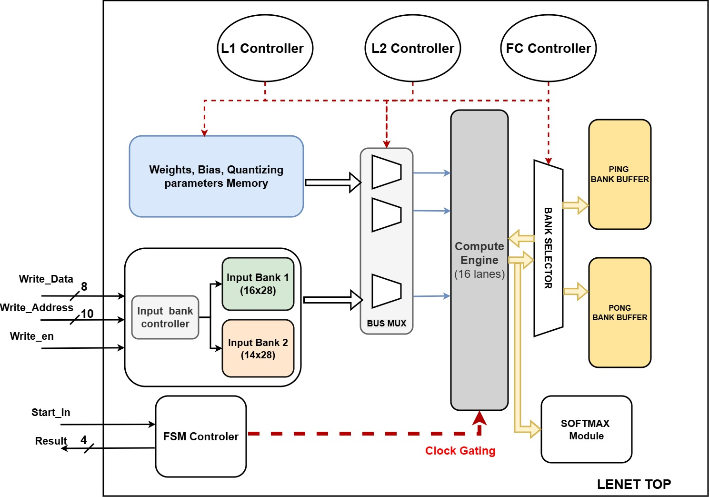
> _Figure: LeNet-5 TOP IP — L1 Controller, L2 Controller, FC Controller, Shared Compute Engine, Ping-Pong Buffers, Softmax Module_

### Custom LeNet-5 Network (Hardware-Deployed)

```
Input Image       Layer 1                    Layer 2                    FC
  28×28×1   →  Conv(3×3×1→6)   →   Conv(3×3×6→16)   →   FC(400→10)  →  Argmax
           +MaxPool(2×2)+ReLU    +MaxPool(2×2)+ReLU    +Softmax(HW)
           → 13×13×6             → 5×5×16               → 10 neurons
```

**Parameter count:** 4,918 parameters (vs. 60,850 in original LeNet-5 — **92% reduction**)  
**FP32 Accuracy:** 98.44% → **INT8 Accuracy:** 98.39% *(accuracy drop: 0.05%)*

---

## 📂 Repository Structure

```
.
├── rtl/
│   ├── Lenet_Top_v2.sv          # Top-level pipeline controller (phase FSM)
│   ├── Shared_Engine.v          # 16-lane shared compute fabric
│   ├── INT8_MAC_pipelined.v     # 6-stage pipelined INT8 MAC unit
│   ├── adder_tree_signed.v      # Parallel adder tree for MAC accumulation
│   ├── MaxPool_Configurable.v   # Streaming 2×2 max-pooling + ReLU
│   ├── L1_Controller.v          # Conv Layer 1 address & weight scheduler
│   ├── L2_Controller.v          # Conv Layer 2 address & weight scheduler
│   ├── FC_Controller.sv         # Fully-connected layer scheduler
│   ├── input_bank_ctrl.v        # Dual-bank image BRAM controller
│   ├── M10K.v                   # On-chip BRAM primitive wrapper
│   ├── fpga_engine_clock_gate.v # Clock gating cell for the compute engine
│   ├── sofmax_func.v            # Hardware argmax / softmax classifier
│   ├── AXI4_Wrapper.v           # AXI4-Lite slave + MMIO register map
│   └── myip.v                   # Top-level SoC IP wrapper
├── mem/
│   └── index_7.mem              # Sample weight/parameter memory file
├── images/                      # All figures referenced in this README
├── docs/
│   └── Báo_cáo_đồ_án_SoC_pptx.pdf  # Full project presentation (Vietnamese)
└── README.md
```

---

## 🔧 Hardware Design Details

### 1. INT8 MAC Unit — `INT8_MAC_pipelined.v`

A fully pipelined **6-stage MAC unit** capable of processing `CHANNEL_PAR = 6` multiply-accumulate operations in parallel per clock cycle.

```
Stage 1: Subtract zero-points        (Za, Zw)
Stage 2: Parallel INT8 × INT8 multiply
Stage 3: Adder tree → INT32 accumulate
Stage 4: Add bias + multiply by M0   (requantization scale)
Stage 5: Rounding + arithmetic right-shift (fixed-point division)
Stage 6: Add Zo + saturate → INT8 output
```

**Key insight:** The INT32 accumulator prevents overflow for up to 576 MACs (Conv 3×3 × 64 channels), while fixed-point `M0 >> shift` avoids costly floating-point division at run time.


---

### 2. Shared Compute Engine — `Shared_Engine.v`

A **reused processing fabric** containing **16 parallel MAC lanes**, each followed by a configurable MaxPool+ReLU unit. A single engine handles all three network stages (L1, L2, FC) through time-multiplexing, saving significant FPGA resources.

- **16 lanes** compute 16 output channels simultaneously
- **Ping-pong output buffers** overlap computation and readout
- Per-lane `pool_bypass` signal disables pooling for the FC layer
- `lane_active_mask` dynamically disables unused lanes (e.g., only 6 active for L1, 10 for FC)

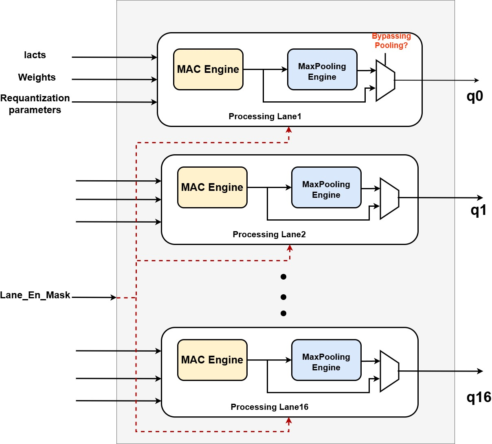

---

### 3. Layer Controllers

| Module | Role | Memory Source | Active Lanes |
|---|---|---|---|
| `L1_Controller.v` | Generates input/weight addresses for Conv1 | LUTRAM (54 weights) | 6 of 16 |
| `L2_Controller.v` | Schedules 6-channel accumulation for Conv2 | 4× M10K weight banks | 16 of 16 |
| `FC_Controller.sv` | Streams 400→10 dot products | 5× M10K weight banks | 10 of 16 |

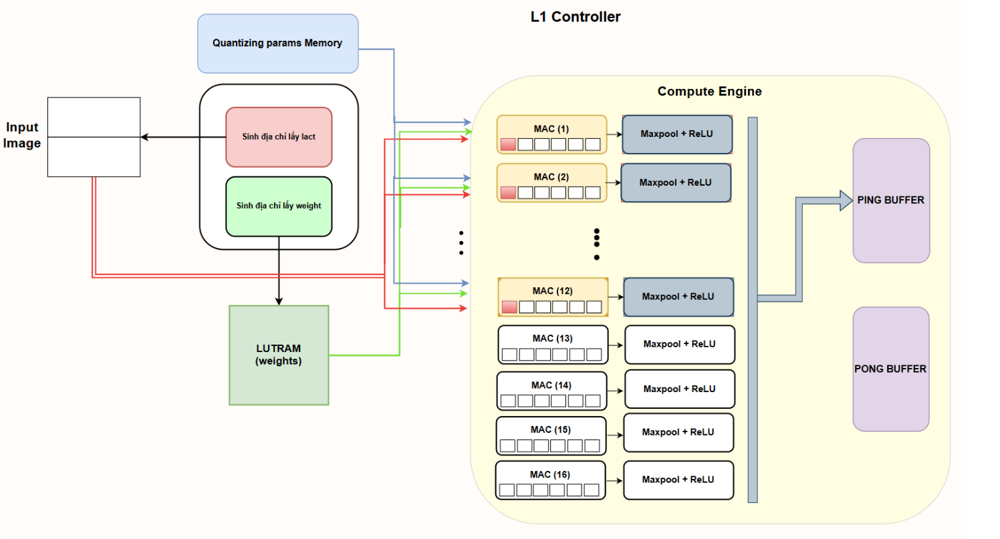

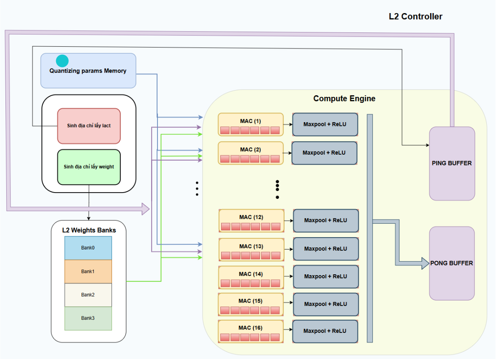

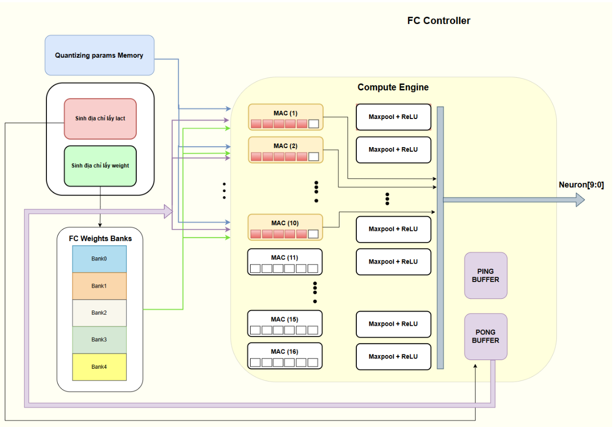

---

### 4. MaxPooling + ReLU — `MaxPool_Configurable.v`

A **streaming 2×2 max-pool** with inline ReLU implemented using a line-buffer approach:

- `FIRST_PIX_Q` register: holds the leading pixel of each row pair
- `TOP_PAIR_BUF`: stores row-wise maximums of the "even" row
- On every two rows, the final 2×2 max is computed and ReLU applied
- `pool_bypass = 1` shorts the datapath for FC-layer operation (no spatial pooling needed)

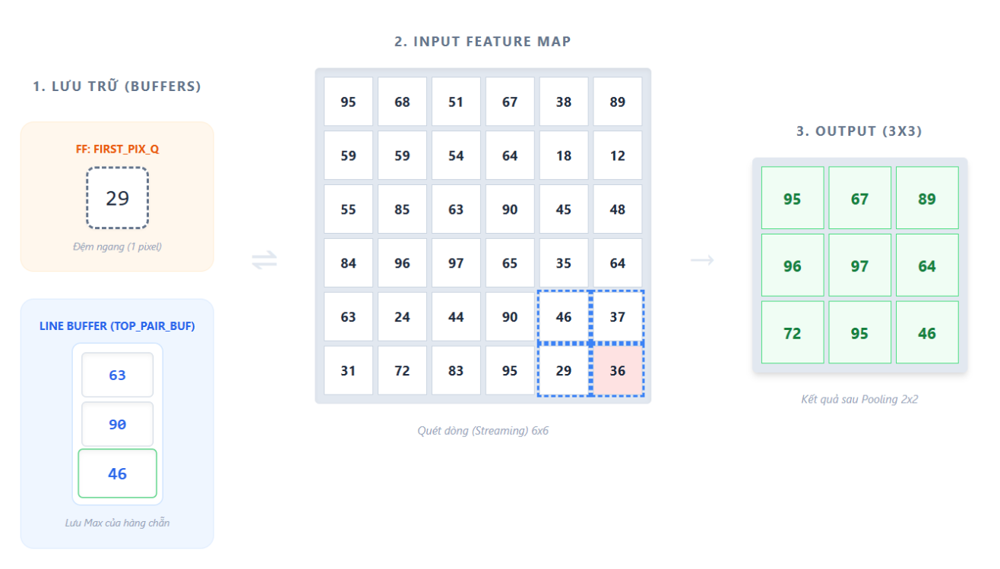

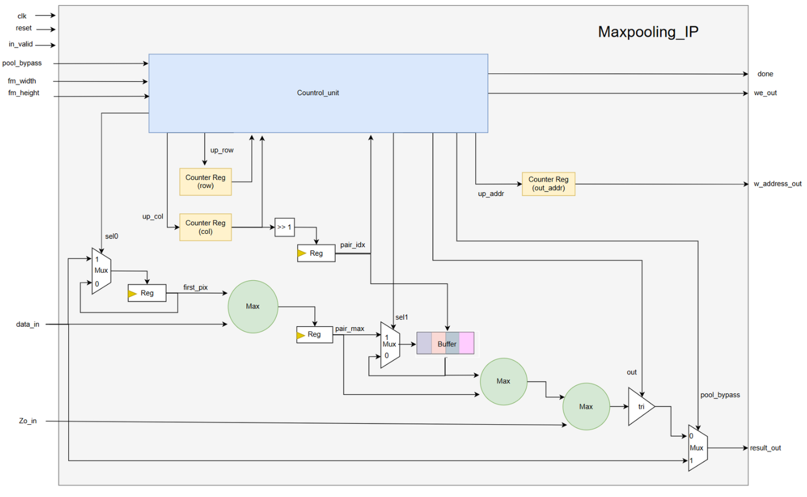

---

### 5. AXI4-Lite Interface — `AXI4_Wrapper.v` / `myip.v`

The accelerator is exposed to the ARM CPU as a memory-mapped peripheral via the following register map:

| Offset | Register | Direction | Description |
|---|---|---|---|
| `0x00` | `START` | W | Pulse to begin inference |
| `0x04` | `RESET` | W | Synchronous reset |
| `0x08` | `W_ADDR` | W | BRAM write address (10-bit) |
| `0x0C` | `W_DATA` | W | Pixel data to write (8-bit) |
| `0x10` | `RESULT` | R | Classification output (4-bit, 0–9) |
| `0x14` | `DONE` | R | Inference-complete flag |

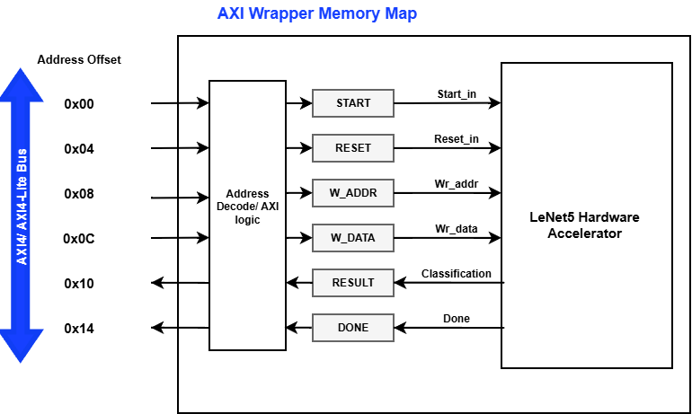

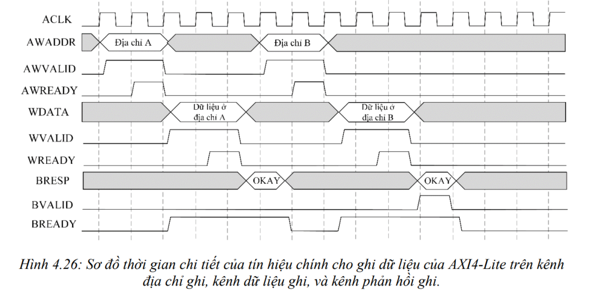

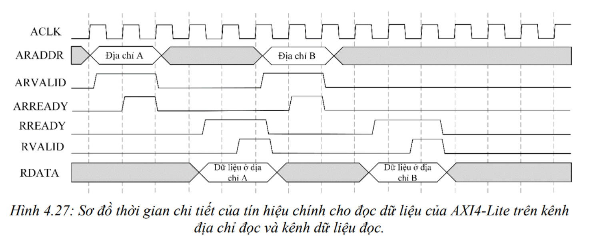

---

## 📊 Implementation Results

### IP Core Only (LeNet-5 Accelerator)

| Metric | Value |
|---|---|
| **Target FPGA** | Xilinx Kria KV260 (xck26-sfvc784-2LV-c) |
| **Clock Frequency** | **200 MHz** |
| **WNS (Setup)** | 0.021 ns ✅ |
| **Inference Latency** | **6,320 clock cycles** (31.6 µs @ 200 MHz) |
| **CLB LUTs** | 15,488 / 117,120 (13.2%) |
| **CLB Registers** | 8,789 / 234,240 (3.7%) |
| **DSPs** | 161 / 1,248 (12.9%) |
| **Block RAM Tiles** | 7.5 / 144 (5.2%) |
| **Total On-Chip Power** | **0.548 W** |
| **Dynamic Power** | 0.258 W (47%) |

### Full SoC System (Zynq UltraScale+ + IP)

| Metric | Value |
|---|---|
| **PL Clock** | 166.667 MHz |
| **PS Clock** | 100 MHz |
| **Total On-Chip Power** | **2.991 W** |
| **PL Logic Power** | 0.302 W |
| **Measured Accuracy (10K images)** | **98.46%** (9,846 / 10,000) |
| **Average Inference Time** | **62.42 µs/image** |

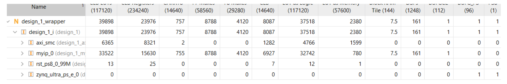

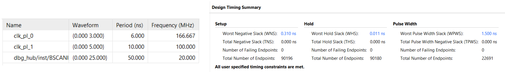

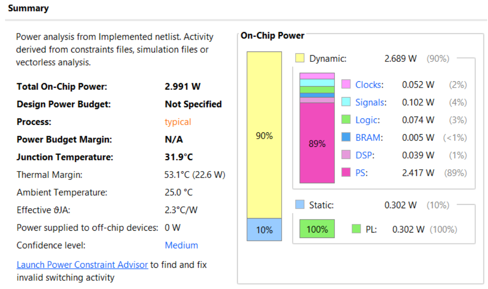

---

## ⚡ Performance Comparison

| Metric | Park & Sung, 2016 [1] | Choudhari et al., 2020 [2] | **This Work** |
|---|:---:|:---:|:---:|
| **Platform** | Xilinx Zynq ZC706 | Kintex-7 xck325 | Kria KV260 |
| **Network** | Fully Connected | Custom LeNet-5 | Custom LeNet-5 |
| **Precision** | 8-bit fixed-point | Q16.6 fixed-point | **INT8** |
| **Accuracy** | 98.92% | 95.33% | **98.46%** |
| **Inference Time** | 14.2 µs/image | 2.375 µs/image | 62.42 µs/image |
| **Frequency** | 172 MHz | 40 MHz | **200 MHz** |
| **Performance** | 408.51 GOPS | 10.44 GOPS | 9.67 GOPS |
| **Performance Density** | 3.37 GOPS/kLUT | 0.429 GOPS/kLUT | **0.624 GOPS/kLUT** |
| **Total Power (SoC)** | 4.982 W | — | **2.991 W** |
| **Energy/Image** | 71 µJ/image | — | **89.73 µJ/image** |
| **DSPs** | 900 | 648 | **161** |
| **BRAM Tiles** | 323 | 108 | **7.5** |
| **LUTs** | 121,173 | 26,668 | **15,488** |

> [1] J. Park, W. Sung — "FPGA based implementation of deep neural networks using on-chip memory only," arXiv:1602.01616, 2016.  
> [2] O. Choudhari et al. — "Hardware accelerator: Implementation of CNN on FPGA for digit recognition," IEEE VDAT, 2020.

---

## 🚀 Getting Started

### Prerequisites

- **Vivado** 2022.1 or later (with Zynq UltraScale+ IP support)
- **Vitis** 2022.1 (for software build)
- **Python 3.8+** with PyTorch (for retraining / re-quantization)
- Target board: **Xilinx Kria KV260** (or compatible Zynq UltraScale+ board)

### 1. Clone the Repository

```bash
git clone https://github.com/<your-username>/lenet5-fpga-accelerator.git
cd lenet5-fpga-accelerator
```

### 2. Synthesize & Implement (Vivado)

```tcl
# In Vivado TCL console
create_project lenet5_accel ./vivado_project -part xck26-sfvc784-2LV-c
add_files -fileset sources_1 [glob ./rtl/*.v ./rtl/*.sv]
add_files -fileset sim_1    [glob ./sim/*.v]
add_files -fileset sources_1 [glob ./mem/*.mem]
set_property top Lenet_Top_v2 [current_fileset]
launch_runs impl_1 -to_step write_bitstream -jobs 8
```

### 3. Create the AXI IP and Block Design

1. Package `myip.v` (with `AXI4_Wrapper.v`) as a Vivado IP
2. Create a Block Design:
   - Add **Zynq UltraScale+ MPSoC**
   - Add **myip_v2_0**
   - Connect via **AXI SmartConnect**
   - Add **Processor System Reset**
3. Validate, generate bitstream, and export hardware

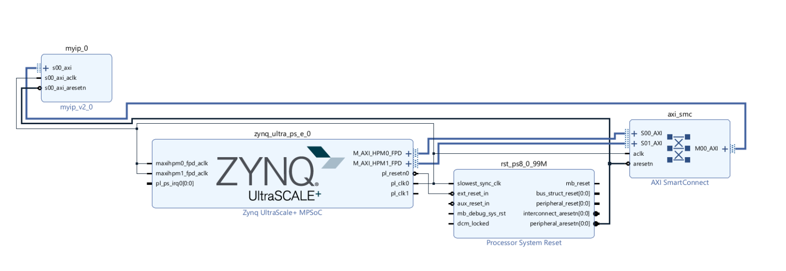

### 4. Build Software (Vitis / Linux)

```c
// Core inference loop (pseudo-code)
int fd = open("/dev/mem", O_RDWR | O_SYNC);
void* ip = mmap(NULL, 0x10000, PROT_READ|PROT_WRITE,
                MAP_SHARED, fd, 0xA0000000);

// Write reset
*(volatile uint32_t*)(ip + 0x04) = 1;
// Write 784 pixels
for (int i = 0; i < 784; i++) {
    *(volatile uint32_t*)(ip + 0x08) = i;
    *(volatile uint32_t*)(ip + 0x0C) = image[i];
}
// Start inference
*(volatile uint32_t*)(ip + 0x00) = 1;
// Poll DONE
while (!(*(volatile uint32_t*)(ip + 0x14)));
// Read result
uint32_t pred = *(volatile uint32_t*)(ip + 0x10) & 0xF;
```

---

## 🧪 Simulation & Functional Verification

A self-checking testbench streams 1,000 MNIST test images through the RTL model and compares hardware outputs against pre-computed software labels.

```bash
# Run simulation (ModelSim / QuestaSim)
vsim -do sim/run_sim.tcl
```

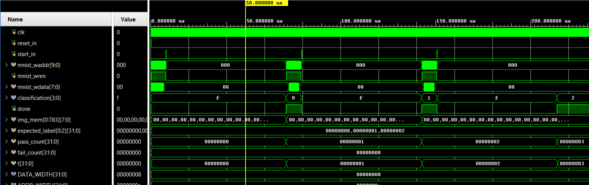

**Simulation results:**
- Inference latency: **6,320 clock cycles** (start → done)
- All timing constraints met (WNS = 0.021 ns)

---

## 🏋️ Model Training & Quantization

The baseline FP32 model is trained with PyTorch and converted via Post-Training Quantization (PTQ):

```python
# Architecture definition
class CNN(nn.Module):
    def __init__(self):
        super().__init__()
        self.conv1 = nn.Conv2d(1, 6, 3)   # L1: 54 params
        self.relu1 = nn.ReLU()
        self.pool1 = nn.MaxPool2d(2, 2)
        self.conv2 = nn.Conv2d(6, 16, 3)  # L2: 864 params
        self.relu2 = nn.ReLU()
        self.pool2 = nn.MaxPool2d(2, 2)
        self.flatten = nn.Flatten()
        self.fc = nn.Linear(400, 10)      # FC: 4000 params

# Training config
# Dataset: MNIST | Optimizer: Adam | Epochs: 40 | Batch: 1000
# FP32 Accuracy: 98.44%
```

**PTQ Flow:** FP32 Baseline → Setup Qconfig → Calibration → Convert → INT8 Model  
**INT8 Accuracy:** 98.39% *(drop: only 0.05%)*

---

## 📈 Design Decisions & Optimizations

### ♻️ Shared Processing Engine (Resource Reuse)
Instead of instantiating separate hardware for Conv1, Conv2, and FC, a **single 16-lane engine** is time-multiplexed across all three layers. This reduces LUT count by ~3× compared to a layer-parallel design.

### 🔁 Partial Loop Unrolling
Convolution loops are unrolled along the **channel dimension** (`CHANNEL_PAR = 6`) and across **16 output lanes** simultaneously. This gives a 96× throughput improvement over a fully-serial implementation while keeping multiplier count reasonable.

### 🔋 Clock Gating
`fpga_engine_clock_gate.v` disables the compute engine clock during idle phases (image loading, ping-pong buffer swap), reducing dynamic power consumption.

### 🏓 Ping-Pong Buffering
Output feature maps are written to a **double-buffered local memory**:
- L1 writes → Bank 0; L2 reads Bank 0, writes Bank 1; FC reads Bank 1
- Enables overlap of computation and data readout between layers

---

## 🐛 Known Limitations

- Architecture is optimized for this specific LeNet-5 variant; reconfigurability for other networks is limited
- Dataflow is hand-crafted (Weight-Stationary / Row-Stationary optimizations not yet applied)
- Layers with few channels (e.g., L1 with 6 channels) under-utilize the 16-lane engine
- Image loading via AXI MMIO is a bottleneck for high-throughput batch inference

## 🔭 Future Work

- [ ] Configurable CNN accelerator supporting arbitrary layer shapes
- [ ] Eyeriss-like Row-Stationary dataflow for better data reuse
- [ ] AXI DMA + streaming interface to eliminate MMIO bottleneck
- [ ] Inter-layer pipeline overlap (load–compute–store)
- [ ] Tiling + banked memory for larger networks (ResNet, MobileNet)

---
## 📜 License

This project is released under the [MIT License](LICENSE).

---

<div align="center">

**⭐ If this project helped you, please give it a star! ⭐**

Made with 💚 at UIT · Ho Chi Minh City, Vietnam · 2025

</div>
