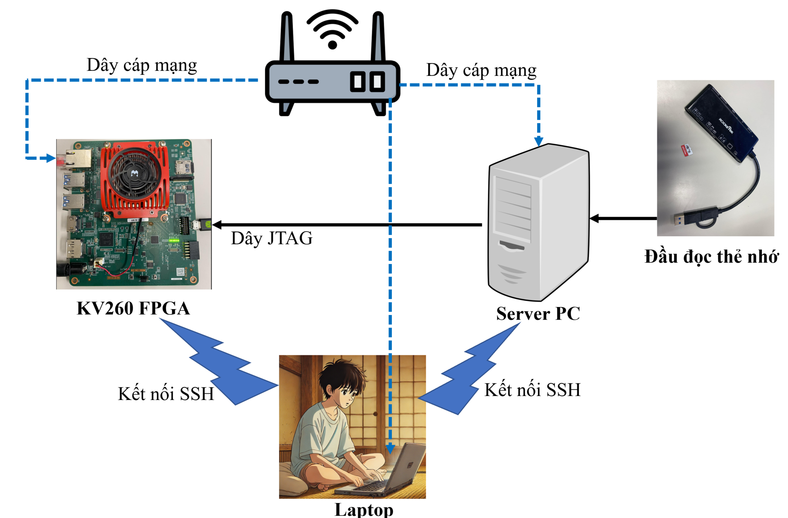
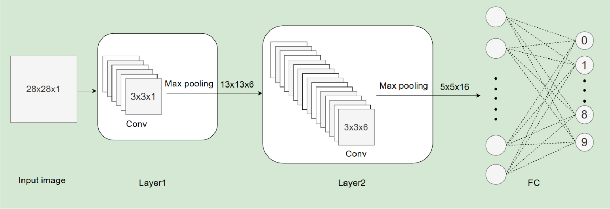
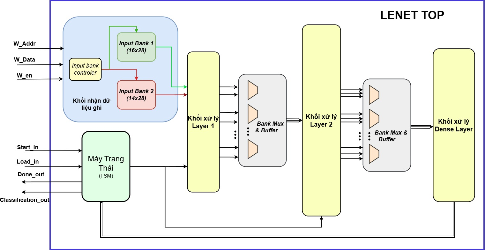
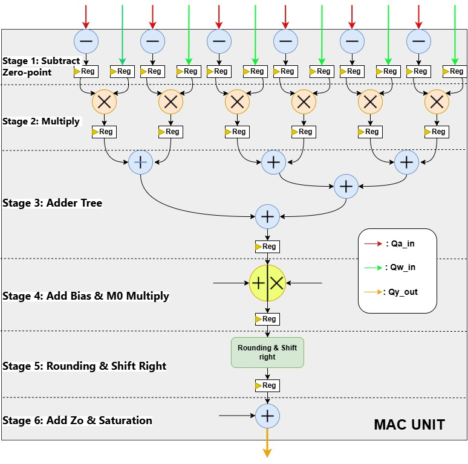
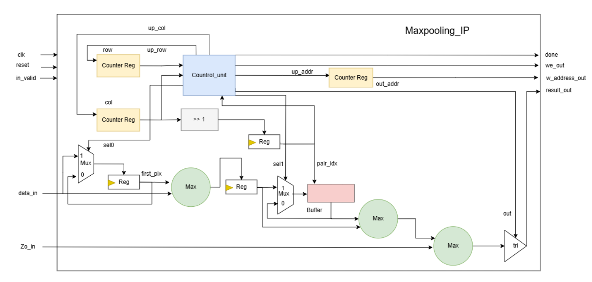
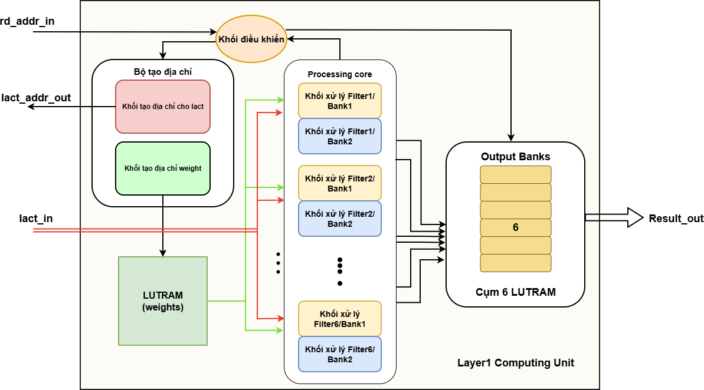
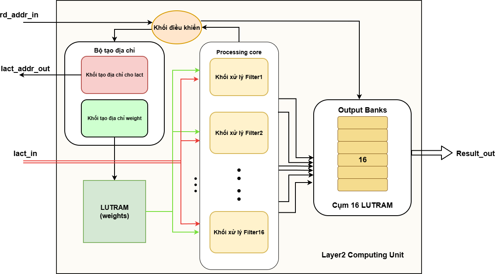
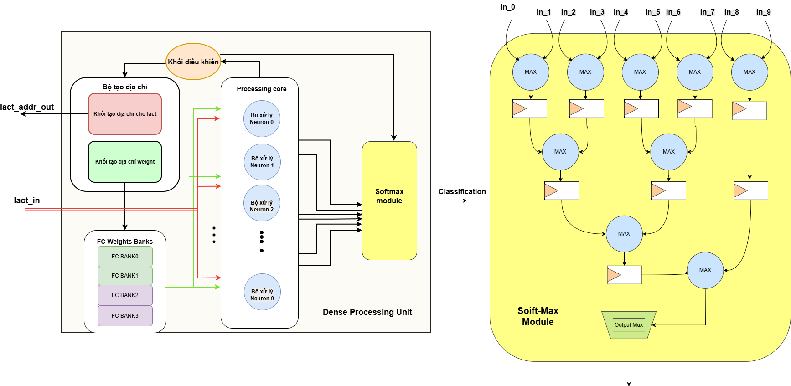
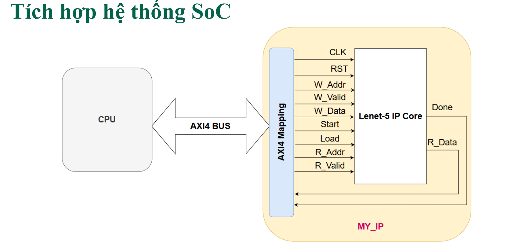

# Fully Quantized Custom LeNet-5 Implementation in Verilog HDL

A detailed RTL implementation of an INT8-quantized LeNet-5 style accelerator, organized as reusable SystemVerilog/Verilog hardware modules for convolution, pooling, activation, and dense classification.
### Video Demos: https://youtu.be/iHpeTRM6k9U](https://youtu.be/g2tYO0fw6e4?si=Lm1-rYTDfhITySBh
---

## Project Information

- **Author:** Do Khanh
- **School:** UIT (University of Information Technology)
- **Domain:** FPGA/SoC Hardware Acceleration for Deep Learning Inference
- **Model Type:** Quantized LeNet-5
- **Arithmetic Focus:** INT8 datapath with wider internal accumulation

---

## 1. Introduction

This project implements a hardware-oriented LeNet-5 inference pipeline in Verilog HDL.  
The design is decomposed into clear functional blocks and wrappers, making it suitable for:

- studying neural-network hardware mapping,
- testing quantized arithmetic behavior at RTL level,
- integrating a custom accelerator into larger FPGA/SoC systems.

Unlike software inference where all operations are sequentially executed on a CPU/GPU, this implementation expresses each stage as dedicated hardware dataflow modules with cycle-level control.
## 2. Equipment Setup for Kria KV260 Development

### A. Hardware Overview

In this project, I set up a development environment to work with the Kria KV260 FPGA platform for building and running an embedded SoC system.

The main hardware components include:

- **Kria KV260 FPGA**  
  Used as the core platform to implement hardware design and run embedded Linux applications.

- **Ethernet (LAN) cable**  
  Provides network connectivity for Internet access and SSH communication.

- **JTAG cable**  
  Connects the FPGA to the development machine for bitstream programming, debugging, and UART console access.

- **MicroSD card + card reader**  
  Stores the boot image, including:
  - `BOOT.BIN`
  - Linux kernel
  - Root filesystem

- **Server PC (Linux)**  
  Acts as the primary development environment:
  - Runs **Vivado** for hardware design  
  - Runs **PetaLinux** for embedded Linux development  

- **Personal Laptop/PC**  
  Used for remote access and control:
  - SSH (MobaXterm, VSCode, Terminal)
  - File transfer (e.g., WinSCP)
  - Optional: VMware (if using Windows)

---

### B. System Connections

After preparing the hardware, I established the following connections:

- **KV260 FPGA**
  - Connected to the router via Ethernet for network access
  - Connected to the Server PC via JTAG for programming and debugging

- **Server PC**
  - Connected to the same local network
  - Equipped with a card reader to prepare the microSD card

- **Laptop/PC**
  - Connected to the same network
  - Used to remotely access the Server and FPGA via SSH

---

### Notes

- All devices must be on the same **LAN/WiFi network** for proper communication.
- The **microSD card** is used to boot the Linux operating system on the KV260.

---

## 4. High-Level Model Architecture

The implemented network follows a LeNet-5 style flow:

1. Input image ingestion
2. Layer 1 convolution processing
3. Max-pooling + activation
4. Layer 2 convolution processing
5. Max-pooling + activation
6. Dense / fully connected classification stage
7. Final class output

### Figure Placeholder A - LeNet-5 hardware-oriented model overview

      

---

## 5. Overall IP Hardware Design

At system level, the accelerator is assembled as a top IP that coordinates:

- input bank management,
- Layer 1 processing pipeline,
- Layer 2 processing pipeline,
- Dense processing pipeline,
- control FSM and status signaling.

The top block routes data and control between layer wrappers while preserving timing consistency across the pipeline.

### Figure Placeholder B - Overall architecture of LeNet-5 IP

      

---

## 6. Core Compute Blocks

### 6.1 INT8 MAC Unit

The MAC unit is the arithmetic kernel of the design. A typical compute sequence includes:

- input offset/zero-point adjustment (if enabled by quantization flow),
- INT8 multiplication,
- adder-tree style reduction,
- bias or scaling-factor combination,
- rounding/right-shift normalization,
- output saturation/clipping.

This staged implementation improves timing closure and enables deeper pipelining.

### Figure Placeholder C - MAC unit internal pipeline

      

### 6.2 Max-pooling + ReLU Block

This block performs activation-domain post-processing:

- local-window max selection (pooling),
- ReLU filtering,
- stream-compatible output formatting.

It reduces spatial dimensions and propagates dominant features to the next stage.

### Figure Placeholder D - Max-pooling + ReLU architecture

      

---

## 7. Layer Processing Units

### 7.1 Layer 1 Processing Unit

Layer 1 contains:

- control logic for address sequencing and state transitions,
- local weight storage/read logic,
- multiple filter processing branches,
- output banks for staging intermediate feature maps.

It is optimized for first-stage feature extraction from the input image.

### Figure Placeholder E - Layer 1 processing architecture

      

### 7.2 Layer 2 Processing Unit

Layer 2 receives Layer 1 output features and performs deeper convolutional extraction.  
It similarly contains:

- control and address generation,
- filter compute cores,
- output-bank organization for downstream dense input.

### Figure Placeholder F - Layer 2 processing architecture

      

---

## 8. Dense Processing Unit and Classification

The dense stage transforms final feature vectors into class-level outputs.  
Its responsibilities include:

- feature flattening/arrangement,
- dense neuron accumulation,
- optional Softmax-compatible output conversion.

### Figure Placeholder G - Dense processing + Softmax block

      

---

## 9. SoC Integration Concept

For system-level deployment, the accelerator can be exposed as a custom IP and controlled via mapped registers/signals through a bus interface (e.g., AXI-based integration path).

Typical control/data signals include:

- clock/reset,
- write address/data/valid,
- read address/data/valid,
- start/load/done synchronization.

### Figure Placeholder H - SoC integration view

      

---
## 10. Quantization and Numeric Notes
This project uses **PTQ (Post-Training Quantization)** as the quantization methodology for deployment.

### 10.1 What is PTQ?

**PTQ** converts a pre-trained floating-point model (typically FP32) into a lower-precision model (INT8 in this project) **after training is complete**, without re-training the full network.  
In practice, PTQ uses calibration data to estimate activation ranges and derive quantization parameters (e.g., scale and zero-point), then maps float tensors to integer tensors for efficient hardware inference.

### 10.2 Why PTQ is used in this project

- It allows a faster path from trained model to RTL deployment.
- It matches the hardware goal of efficient INT8 arithmetic.
- It avoids the full cost and complexity of quantization-aware retraining.

### 10.3 PTQ advantages

- **Fast deployment:** no full retraining loop is required.
- **Lower engineering cost:** simpler workflow than QAT for many projects.
- **Good hardware compatibility:** naturally aligns with INT8 MAC-based accelerators.
- **Portable flow:** can be applied to many trained checkpoints with calibration.

### 10.4 PTQ limitations

- **Potential accuracy drop:** especially for sensitive layers or low-bit settings.
- **Calibration sensitivity:** quality depends on representative calibration data.
- **Less robust than QAT:** difficult distributions may quantize poorly without retraining.
- **Per-layer tuning overhead:** some models still need manual tuning of clipping/scales.

- Input/weight/activation datapath primarily targets signed INT8 representation.
- Internal accumulators use extended precision to reduce overflow risk.
- Final stage outputs may be normalized, rounded, shifted, and saturated based on module policy.
- Exact quantization calibration (scale/zero-point) can be adapted to your training/export flow.

Post-Training Quantization flow:

---

## 11. Future Improvements
- Introduce energy-aware dataflow mapping (e.g., **Row-Stationary (RS) dataflow**) to minimize data movement between memory hierarchy levels and reduce overall processing energy.
- Re-architect memory scheduling with local reuse buffers (weights, activations, partial sums) to further reduce off-chip/on-chip transfer cost.
- Add automated regression testbench and golden-check scripts for fast functional verification after every RTL update.
- Provide per-layer latency, throughput, and energy-per-inference reports to guide design-space exploration.
- Add parameterized support for configurable image size, channel count, kernel size, and parallelism factors.
- Explore mixed-precision or adaptive quantization (INT8/INT6/INT4 in selected stages) for better efficiency-accuracy trade-offs.
- Improve documentation with timing diagrams, synthesis statistics, and resource breakdown (LUT/FF/BRAM/DSP).

---

## 12. Acknowledgment

This project is built for learning, experimentation, and practical hardware acceleration research in FPGA-based AI systems. Contributions, feedback, and improvements are welcome.
